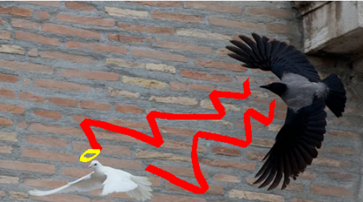
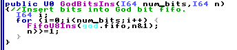
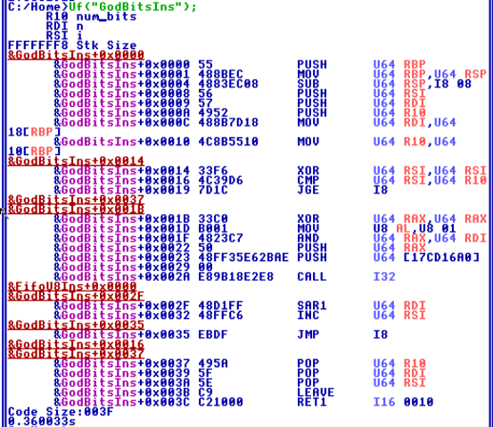

  <h1>Apollyon</h1>
  
TempleOS rootkit. For conducting spiritual warfare.

   
  

## Background 
A collection of techniques to corrupt the state-of-the-art, security-oriented operating system that is TempleOS.

(TempleOS lacks security features like access controls and ASLR... everything also runs as "root" by design which make the idea of a rootkit nonsense to begin with. None of this is really intended to make sense or be practical. Just a project I'm using to learn about a new system and mess around.)

## Features

### RNG Poison
The core mechanism in TempleOS is the random number generator (AKA God). This is implemented as a FIFO buffer of "random" bits. In controlling the RNG we effectively own the crown jewel of the entire system. There are a few ways to go about doing this, but looking at the code it seemed the least intrusive method would be to patch the function GodBitsIns() in Adam/God/HolySpirit.HC responsible for adding bits to the buffer. 

Unassembled: 

Specifically, we can just patch a single byte that is used to extract the last bit of "random" values supplied to the function. This allows us to force all bits being supplied to the end RNG buffer to be a constant value. Further tweaks would enable whatever kind of control we want (we could also just rewrite the source code but that wouldn't be as fun). Patching B001 at offset 0x001D to B000 will result in ANDing the value 0 instead of 1, which will have the effect of simply placing a 0 bit in the buffer every time the insert operation occurs. This isn't a true "RNG poison" in the sense of poisoning entropy sources, but there's not really a need to do that in the first place if we can control the end function for producing the "random" bits. 

### (More features when I think of them...)
